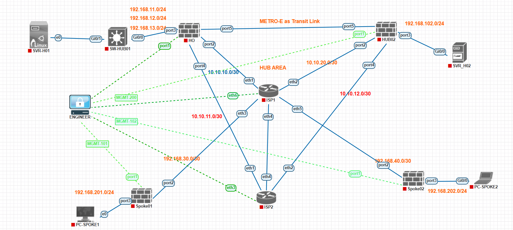

# 🚀 FortiGate Enterprise SD-WAN Multi-Hub

Enterprise SD-WAN Multi-Hub Lab using FortiGate.

---

## Overview

This repository contains design, configuration, verification and troubleshooting documentation.

> 🚧 Work In Progress
# Network Topology

# 📚 Documentation

- [Introduction](docs/01-Introduction.md)
- [Topology](docs/02-Topology.md)
- [BGP Design](docs/03-BGP.md)
- [SD-WAN Design](docs/04-SDWAN.md)
- [Configuration](docs/05-Configuration.md)
- [Verification](docs/06-Verification.md)
- [Troubleshooting](docs/07-Troubleshooting.md)
